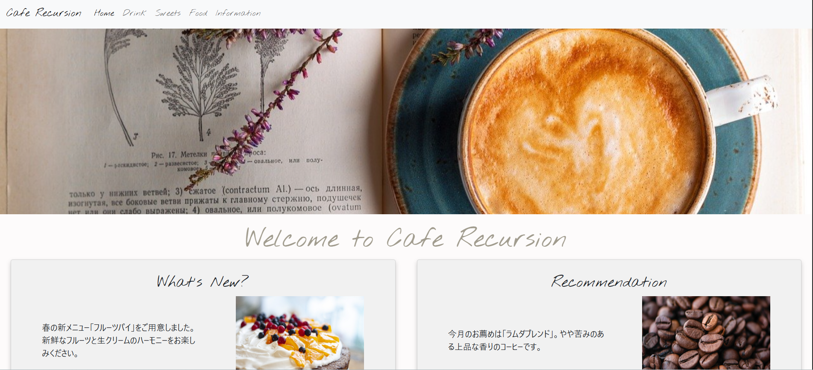
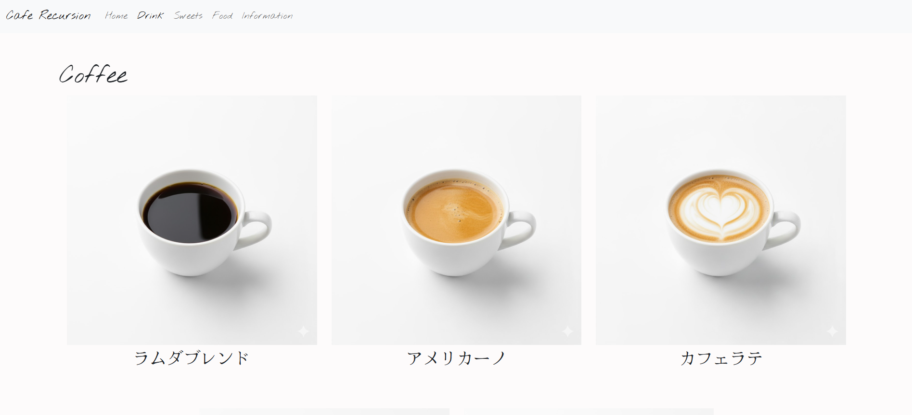
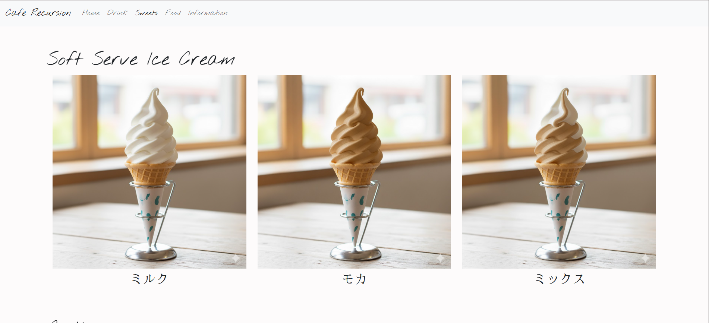
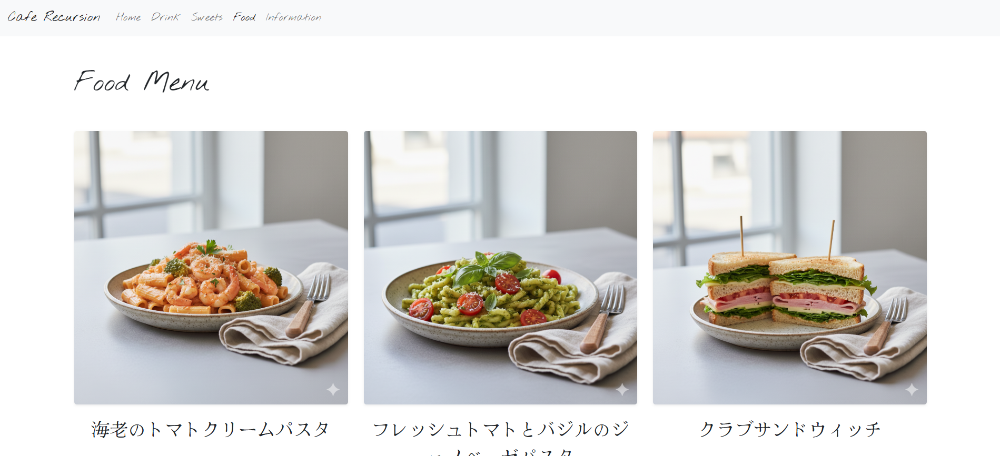
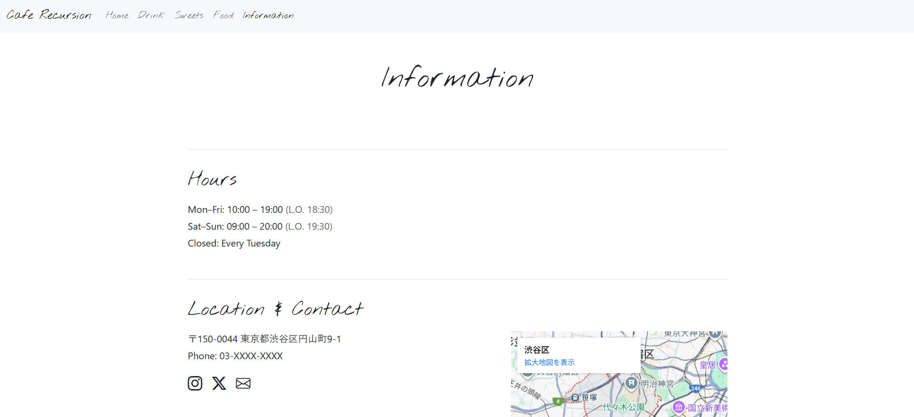

# Cafe Recursion
## プロジェクト概要
Recursion (https://recursionist.io/) の初心者向けチーム開発で架空のカフェのWebページを作成しました。 
こちら (デプロイ後のURL)からアクセスできます。

## 各ページの紹介
| Home | Drink |
| ---- | ---- |
|  |  |
| Cafe RecursionのHome画面です。 | ドリンクのメニューが載っているページです |

| Sweets | Food | Information |
| ---- | ---- | ---- |
|  |  |  |
| スイーツのメニューが載っているページです | フードのメニューが載っているページです。 | インフォメーションが載っているページです。|

## 使用技術や言語
- HTML
- CSS
- Bootstrap

## 開発メンバー
- Morry (https://github.com/HikaruCS) (リーダー)
- h.oga11348 (https://github.com/hana4-prg)
- KatoKoshi0209 (https://github.com/KatoKoshi0209)